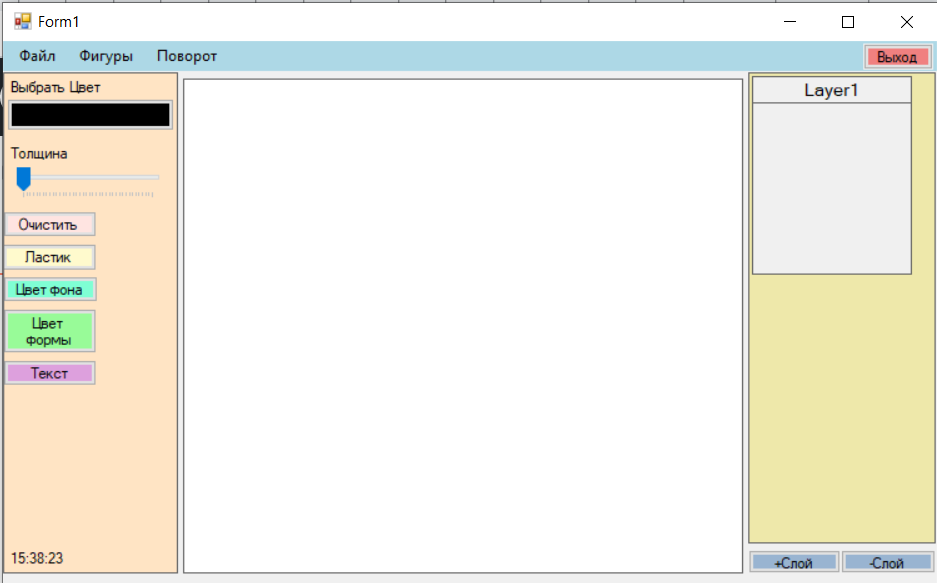
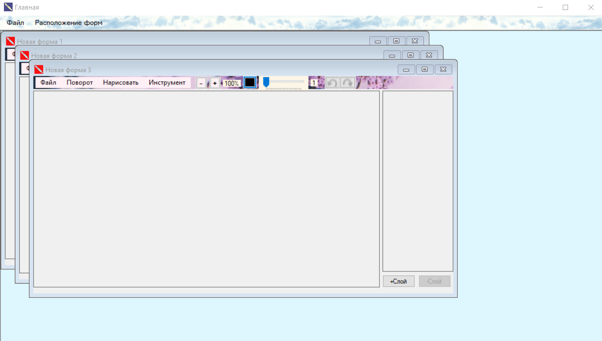

# Графический редактор ( g_e )

Реализованный функционал:

0. Работа с несколькими формами одновременно:
    Функции расположения форм:
    •	Каскад
    •	Плитка вертикально
    •	Плитка горизонтально
1. Работа с файлами:
  •	Создание
  •	Открытие
  •	Сохранение
2. Поворот изображения:
  •	Вправо на 90°
  •	Влево на 90°
  •	На 180°
  •	Отображение по горизонтали
  •	Отображение по вертикали
3. Функции масштабирования изображения:
  •	По центру
  •	Масштабировать
  •	Сохранять пропорции
  •	Автоматическое масштабирование
  •	Реальный размер
  •	Пользовательское масштабирование (при выборе данного элемента становятся доступными кнопки plusButton и minusButton, позволяющие увеличивать/уменьшать изображение в 1.1 раз, а также изменяется Label, отображающий текущий масштаб изображения в процентах)
4. Функция рисования:
  •	Прямоугольник
  •	Эллипс
  •	Линия
  •	Возврат к кисти (выбрана по умолчанию)
  •	Надпись (при выборе данного элемента появляется дополнительное меню, позволяющее выбрать шрифт и текст самой надписи (ввод текста реализован в виде формы TextForm)
5. Меню инструментов:
  •	Заливка фона
  •	Ластик
6. Дополнительный функционал:
  •	Затемнить изображение (в строке меню "Файл")
  •	Осветлить изображение (в строке меню "Файл")
  •	Смешать текущее изображение с другим (в строке меню "Файл")
  •	Кнопка выбора цвета
  •	Кнопка выбора толщины
  •	Демо-функция заливки внутри какой-либо части, обведённой кистью
7. Функции Undo/Redo.
8. Работа со слоями:
  •	Добавление/удаление нового слоя
  •	Перестановка слоёв
  

Первая версия программы:

Обновленная версия программы:

